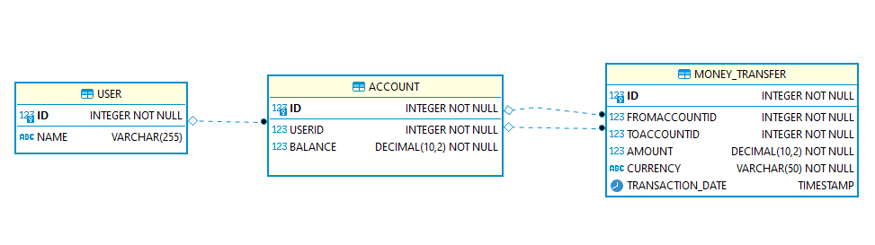

# Transfer REST API

REST API that allows money transfer between accounts by using Vert.x .  

### Package and run with vertx-maven-plugin
<pre>
$ mvn clean install -U -X vertx:run
</pre>
### Start application from command line via : 
<pre>
moneytransfer\target$ java -jar .\moneytransfer-0.0.1-SNAPSHOT.jar  
[vert.x-eventloop-thread-1] INFO  c.company.moneytransfer.util.DBUtil - Start setup initial database.
[vert.x-eventloop-thread-1] INFO  c.company.moneytransfer.util.DBUtil - Altered money_transfer table!
[vert.x-eventloop-thread-1] INFO  c.company.moneytransfer.util.DBUtil - Altered money_transfer table!
[vert.x-eventloop-thread-1] INFO  c.company.moneytransfer.util.DBUtil - Inserted sample row into the user table!
[vert.x-eventloop-thread-1] INFO  c.company.moneytransfer.util.DBUtil - Inserted sample row into the user table!
[vert.x-eventloop-thread-1] INFO  c.company.moneytransfer.util.DBUtil - Inserted sample row into the account table!
[vert.x-eventloop-thread-1] INFO  c.company.moneytransfer.util.DBUtil - Inserted sample row into the account table!
[vert.x-eventloop-thread-1] INFO  c.company.moneytransfer.util.DBUtil - Created sample database schema!
[vert.x-eventloop-thread-1] INFO  c.company.moneytransfer.util.DBUtil - Sample DB rows populated for user and account tables!
</pre>

NOT : If you receive "java.net.BindException" then find and kill the running process on port 9090 of WIN10 OS.  
$ Failed to deploy : java.net.BindException: Address already in use: bind
<pre>
$ netstat -nao | find "9090"
TCP    0.0.0.0:9090           0.0.0.0:0              LISTENING       9292
TCP    [::]:9090              [::]:0                 LISTENING       9292

$ taskkill /PID 9292 /F
SUCCESS: The process with PID 9292 has been terminated.
</pre>
### Tech Stack
<pre>
Java 11
vertx-core
vertx-web
vertx-jdbc-client
vertx-unit
vertx-junit5
hsqldb
logback-classic
maven
vertx-maven-plugin
</pre>
### Database ER diagram :  
   

### Database Tables
CREATE TABLE user(id INTEGER GENERATED BY DEFAULT AS IDENTITY(START WITH 1, INCREMENT BY 1) PRIMARY KEY, name varchar(255));  
CREATE TABLE account(id INTEGER GENERATED BY DEFAULT AS IDENTITY(START WITH 1, INCREMENT BY 1) PRIMARY KEY, userId integer NOT NULL, balance DECIMAL(10,2) NOT NULL );  
CREATE TABLE money_transfer(id INTEGER GENERATED BY DEFAULT AS IDENTITY(START WITH 1, INCREMENT BY 1) PRIMARY KEY, fromAccountId integer NOT NULL, toAccountId integer NOT NULL, amount DECIMAL(10,2) NOT NULL, currency varchar(50) NOT NULL, transaction_date TIMESTAMP DEFAULT CURRENT_TIMESTAMP);  
ALTER TABLE account ADD FOREIGN KEY(userId) REFERENCES user(id);  
ALTER TABLE money_transfer ADD FOREIGN KEY(fromAccountId) REFERENCES account(id);  
ALTER TABLE money_transfer ADD FOREIGN KEY(toAccountId) REFERENCES account(id);  

### Database Tables Definitions
user = Stores user details information  
account = Stores accounts of users and balance information for each account  
money_transfer = Join table for sender, receiver accounts and transfer amount with currency  

### Rest Api Design Decisions

* When the Vert.x application starts in memory hsqldb is initialized and loaded with test data  

* Application can be started directly with the execution of main method inside the com.company.moneytransfer.AppMain class.  

## API OPERATIONS
### Query users

Method : HTTP.GET  
URL : http://localhost:9090/api/users  

Input Test Data : No input just fire the request.  

Request : 
<pre>
{
}
</pre> 
Response : 

HTTP response code 200  
<pre>
[
    {
        "ID": 1,
        "NAME": "user1"
    },
    {
        "ID": 2,
        "NAME": "user2"
    }
]
</pre> 

### Query specific user by user id

Method : HTTP.GET  
URL : http://localhost:9090/api/users/:id  
URL : http://localhost:9090/api/users/1  

Input Test Data : No input just fire the request. "id" field contains user information for the specific user.  

Request : 
<pre>
{
}
</pre> 
Response : 

HTTP response code 200  
<pre>
{
    "ID": 1,
    "name": "user1"
}
</pre> 

### Query accounts of specific user by user id

Method : HTTP.GET  
URL : http://localhost:9090/api/accounts/:userid  
URL : http://localhost:9090/api/accounts/1  

Input Test Data : No input just fire the request. "userid" field contains user information for the specific user.  

Request : 
<pre>
{
}
</pre> 
Response : 

HTTP response code 200  
<pre>
[
    {
        "ID": 1,
        "USERID": 1,
        "BALANCE": 100
    }
]
</pre> 

### Accomplish transfer between accounts

Method : HTTP.POST  
URL : http://localhost:9090/api/transfer  

Input Test Data : Provide required fields for transfer operation.  

Request : 
<pre>
{
	"fromAccountId": 1,
	"toAccountId": 2,
	"amount": 100,
	"currency": "GBP"
}
</pre> 
Response : 

HTTP response code 200  
<pre>
{
    "transferResult": "Money transfer completed successfully!",
    "SenderAccountDetails": {
        "status": "ok",
        "id": 1,
        "userId": 1,
        "balance": 0
    },
    "ReceiverAccountDetails": {
        "status": "ok",
        "id": 2,
        "userId": 2,
        "balance": 300
    }
}
</pre> 

### Query transfers made from given sender account id

Method : HTTP.GET  
URL : http://localhost:9090/api/transfer/:accountid  
URL : http://localhost:9090/api/transfer/1  

Input Test Data : No input just fire the request. "accountid" field contains account information for the specific account.  

Request : 
<pre>
{
}
</pre> 
Response : 

HTTP response code 200  
<pre>
[
    {
        "ID": 1,
        "FROMACCOUNTID": 1,
        "TOACCOUNTID": 2,
        "AMOUNT": 100,
        "CURRENCY": "GBP",
        "TRANSACTION_DATE": "2019-07-21T17:35:09.812Z"
    }
]
</pre> 
